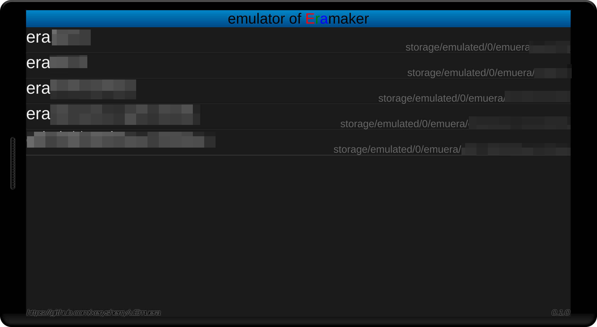
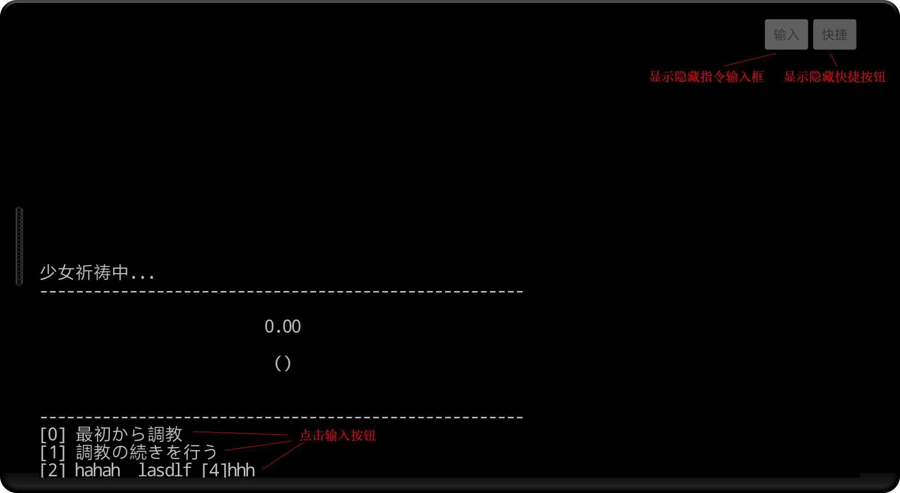
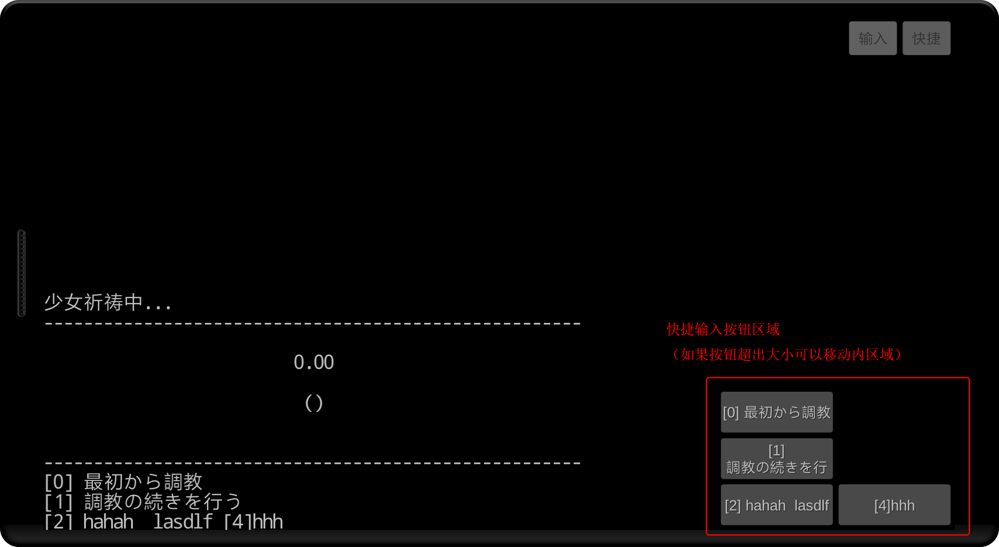
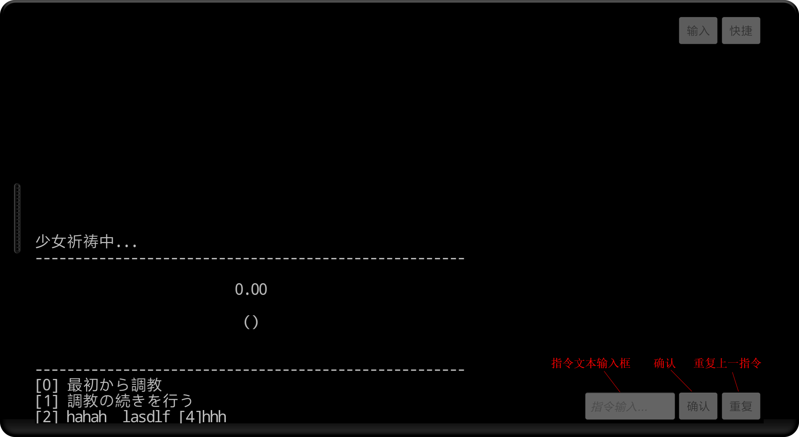
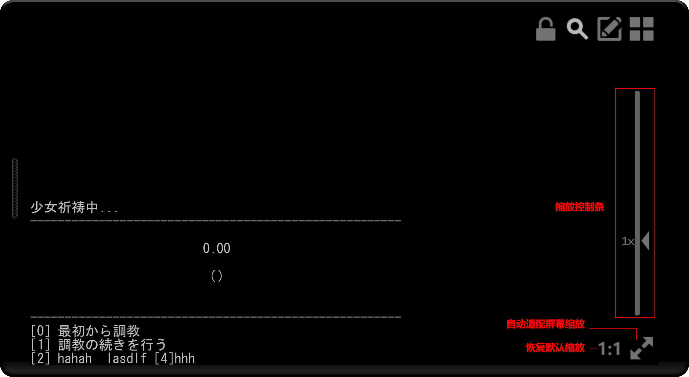

uEmuera
=======

Emuera是Emulator of Eramaker的缩写，是Windows平台下文字游戏平台。

该项目为Emuera的Unity3D移植版本。意在利用Unity3D多平台特性，方便移植到非Windows平台。

当前项目以基于emuera1824版本源代码，部分GXX相关绘制指令没有实现。

几乎可以执行所有era脚本游戏！

下载
----

[https://github.com/xerysherry/uEmuera/releases](https://github.com/xerysherry/uEmuera/releases)

如何使用：
--------

1. 请确保era相关文件编码为UTF8，包括\*.csv, \*.ERB, \*.ERH。

2. 请在初次运行app时，选择允许“文件访问”的权限。

3. 请把处理完毕的era脚本文件夹放置在sdcard下的emuera文件夹内。完整路径为storage/emulated/0/emuera, storage/emulated/1/emuera, storage/emulated/2/emuera

已知问题/需要改进项：
-------------------

1. 无法在app内修改era游戏配置

2. 无调试功能

3. 部分游戏的某些指令效率较低，导致卡顿

4. 可能会比较耗电（Unity3D程序通病）

5. ...

截图
----

开始界面

游戏运行界面

快捷按钮

指令输入

缩放控制

